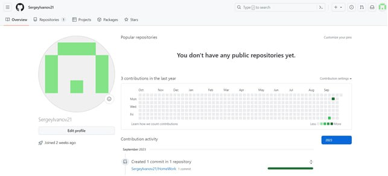
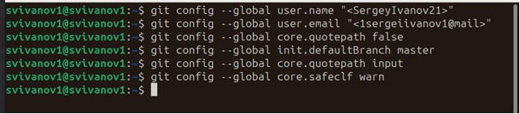
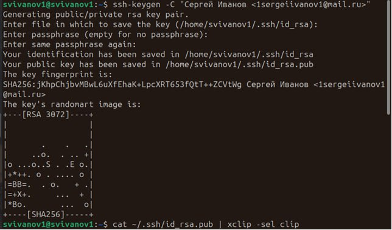
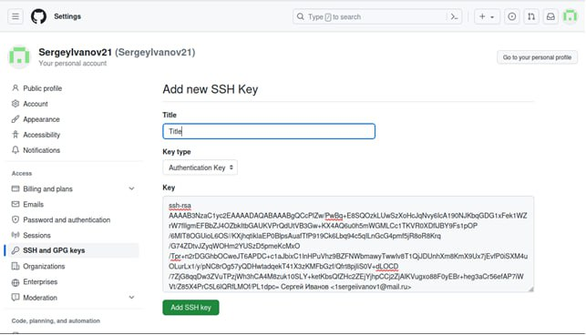
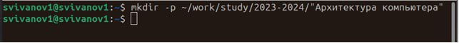
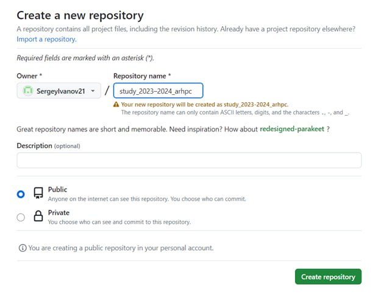
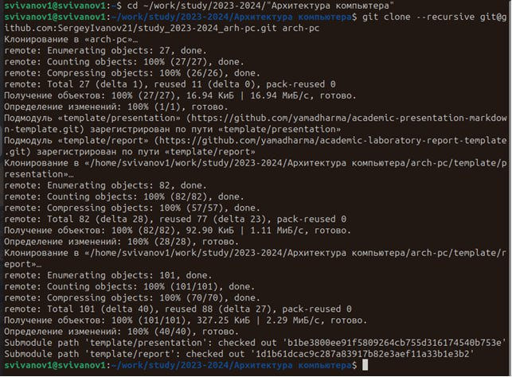
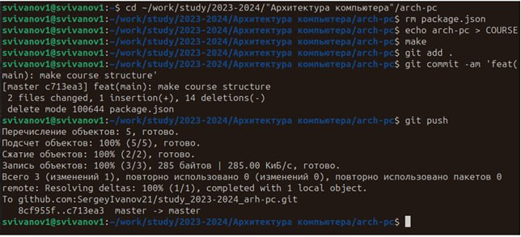
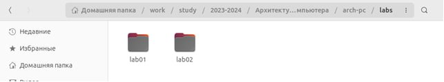
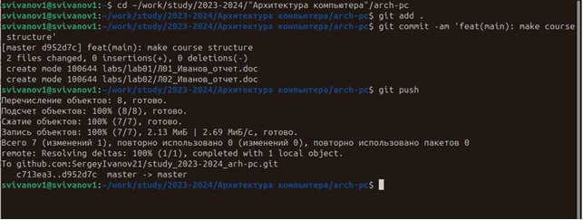

---
## Front matter
title: "Отчет по лабораторной работе №2"
subtitle: "Дисциплина: Архитектура Компьютера"
author: "Иванов Сергей Владимирович"

## Generic otions
lang: ru-RU
toc-title: "Содержание"

## Bibliography
bibliography: bib/cite.bib
csl: pandoc/csl/gost-r-7-0-5-2008-numeric.csl

## Pdf output format
toc: true # Table of contents
toc-depth: 2
lof: true # List of figures
fontsize: 12pt
linestretch: 1.5
papersize: a4
documentclass: scrreprt
## I18n polyglossia
polyglossia-lang:
  name: russian
  options:
	- spelling=modern
	- babelshorthands=true
polyglossia-otherlangs:
  name: english
## I18n babel
babel-lang: russian
babel-otherlangs: english
## Fonts
mainfont: PT Serif
romanfont: PT Serif
sansfont: PT Sans
monofont: PT Mono
mainfontoptions: Ligatures=TeX
romanfontoptions: Ligatures=TeX
sansfontoptions: Ligatures=TeX,Scale=MatchLowercase
monofontoptions: Scale=MatchLowercase,Scale=0.9
## Biblatex
biblatex: true
biblio-style: "gost-numeric"
biblatexoptions:
  - parentracker=true
  - backend=biber
  - hyperref=auto
  - language=auto
  - autolang=other*
  - citestyle=gost-numeric
## Pandoc-crossref LaTeX customization
figureTitle: "Рис."
tableTitle: "Таблица"
listingTitle: "Листинг"
lofTitle: "Список иллюстраций"
lotTitle: "Список таблиц"
lolTitle: "Листинги"
## Misc options
indent: true
header-includes:
  - \usepackage{indentfirst}
  - \usepackage{float} # keep figures where there are in the text
  - \floatplacement{figure}{H} # keep figures where there are in the text
---

# Цель работы

Целью работы является изучить идеологию и применение средств контроля версий. Приобрести практические навыки по работе с системой git.

# Выполнение лабораторной работы

Для начала создадим учетную запись на сайте https://github.com/ и заполним основные данные. (Рис. @fig:001).

{#fig:001 width=70%}

Создадим предварительную конфигурацию git. Откроем терминал и введем команды, указываем имя и email владельца репозитория. Далее настраиваем utf-8 в выводе сообщений git, зададим имя начальной ветки (master), а также настроим параметры autocrlf и safecrlf.(Рис. @fig:002).

{#fig:002 width=70%}

Сгенерируем пару ключей, открытый и приватный. Далее нужно загрузить ключ. Заходим на сайт под своей учётной записью и переходим в меню Setting. Выбираем в боковом меню SSH and GPG keys и нажимаем кнопку New SSH key.  С помощью команды копируем ключ в буфер обмена.(Рис. @fig:003).

{#fig:003 width=70%}

Вставляем ключ в поле на сайте и указываем имя для ключа.(Рис. @fig:004).

{#fig:004 width=70%}

Откроем терминал и создадим каталог для предмета “Архитектура компьютера”.(Рис. @fig:005).

{#fig:005 width=70%}

Перейдем на страницу репозитория с шаблоном курса
https://github.com/yamadharma/course-directory-student-template. Далее выбираем Use this template, в открывшемся окне зададим имя репозитория и создадим его.(Рис. @fig:006).

{#fig:006 width=70%}

Далее откроем терминал и перейдем в каталог курса, клонируем созданный репозиторий.(Рис. @fig:007).

{#fig:007 width=70%}

Перейдем в каталог курса, удалим лишние файлы. Создадим необходимые
каталоги и отправим файлы на сервер.(Рис. @fig:008).

{#fig:008 width=70%}

Создадим отчет по выполнению самостоятельной работы в соответствующем 
каталоге рабочего пространства и скопируем отчеты по выполнению предыдущих лабораторных работ в соответствующие каталоги рабочего пространства.(Рис. @fig:009).

{#fig:009 width=70%}

Загрузим файлы на github.(Рис. @fig:010).

{#fig:010 width=70%}

# Выводы

В ходе лабораторной работы мы изучили идеологию и применение средств контроля версий, а также приобрели практические навыки по работе с системой git.

