---
## Front matter
title: "Отчет по лабораторной работе №4"
subtitle: "Дисциплина: Архитектура Компьютера"
author: "Иванов Сергей Владимирович"

## Generic otions
lang: ru-RU
toc-title: "Содержание"

## Bibliography
bibliography: bib/cite.bib
csl: pandoc/csl/gost-r-7-0-5-2008-numeric.csl

## Pdf output format
toc: true # Table of contents
toc-depth: 2
lof: true # List of figures
fontsize: 12pt
linestretch: 1.5
papersize: a4
documentclass: scrreprt
## I18n polyglossia
polyglossia-lang:
  name: russian
  options:
	- spelling=modern
	- babelshorthands=true
polyglossia-otherlangs:
  name: english
## I18n babel
babel-lang: russian
babel-otherlangs: english
## Fonts
mainfont: PT Serif
romanfont: PT Serif
sansfont: PT Sans
monofont: PT Mono
mainfontoptions: Ligatures=TeX
romanfontoptions: Ligatures=TeX
sansfontoptions: Ligatures=TeX,Scale=MatchLowercase
monofontoptions: Scale=MatchLowercase,Scale=0.9
## Biblatex
biblatex: true
biblio-style: "gost-numeric"
biblatexoptions:
  - parentracker=true
  - backend=biber
  - hyperref=auto
  - language=auto
  - autolang=other*
  - citestyle=gost-numeric
## Pandoc-crossref LaTeX customization
figureTitle: "Рис."
listingTitle: "Листинг"
lofTitle: "Список иллюстраций"
lolTitle: "Листинги"
## Misc options
indent: true
header-includes:
  - \usepackage{indentfirst}
  - \usepackage{float} # keep figures where there are in the text
  - \floatplacement{figure}{H} # keep figures where there are in the text 
---

# Цель работы

Целью работы является освоение процедуры компиляции и сборки программ, написанных на ассемблере NASM. 

# Выполнение лабораторной работы

Создадим каталог для работы с программами на языке ассемблера NASM. Перейдем в созданный каталог, создадим текстовый файл с именем hello.asm и откроем его с помощью gedit. (Рис. @fig:001)

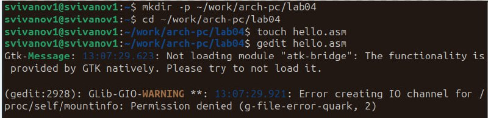{#fig:001 width=70%}

Введем в него следующий текст и сохраним. (Рис. @fig:002)

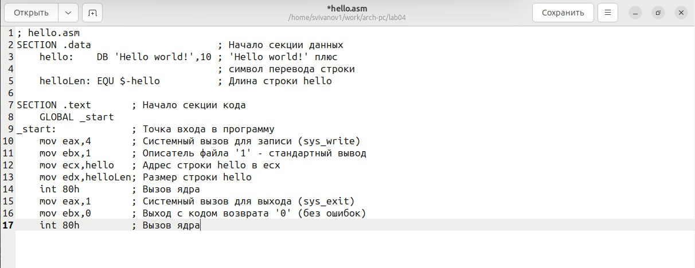{#fig:002 width=70%}

Преобразуем текст программы в объектный код и проверим командой ls. (Рис. @fig:003)

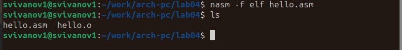{#fig:003 width=70%}

Выполним команду, которая скомпилирует исходный файл hello.asm в obj.o, при этом формат файла будет elf, и в него будут включены символы для отладки а также будет создан файл листинга. Проверим правильность командой ls. (Рис. @fig:004)

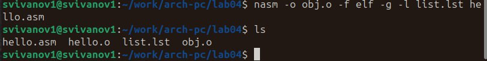{#fig:004 width=70%}

Получим исполняемую программу, передав объектный файл на обработку компоновщику. Проверим командой ls. (Рис. @fig:005)

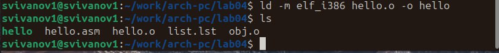{#fig:005 width=70%}

Выполним следующую команду. Исполняемый файл имеет имя main. Обыкновенный файл имеет имя obj.o. (Рис. @fig:006)

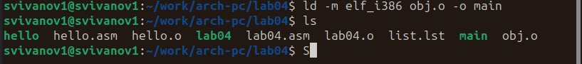{#fig:006 width=70%}

Запустим исполняемый файл командой ./hello (Рис. @fig:007)

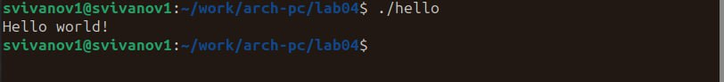{#fig:007 width=70%}

В этом же каталоге с помощью команды cp создадим копию файла hello.asm с именем lab04.asm (Рис. @fig:008)

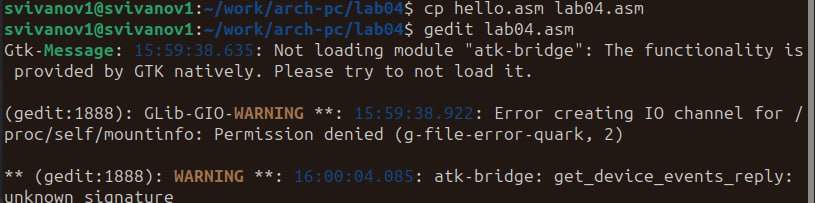{#fig:008 width=70%}

С помощью gedit редактируем так, чтобы на экран выводилась строка с моими фамилией и именем вместо Hello world!. (Рис. @fig:009)

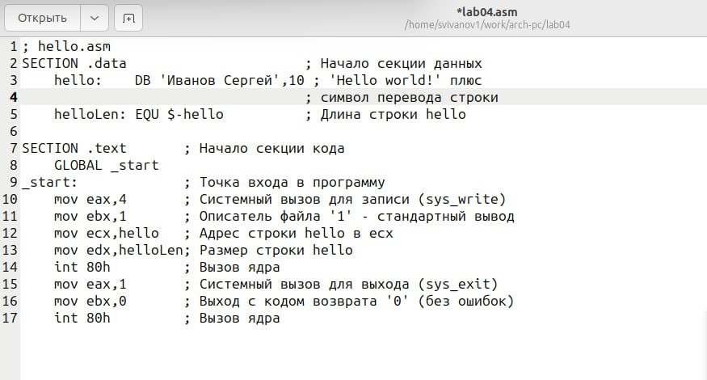{#fig:009 width=70%}

Оттранслируем полученный текст программы в объектный файл. Выполним компоновку объектного файла и запустим исполняемый файл. (Рис. @fig:010)

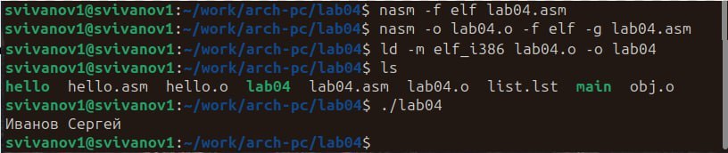{#fig:010 width=70%}

Скопируем файлы hello.asm и lab04.asm в локальный репозиторий и загрузим файлы на Github. (Рис. @fig:011)

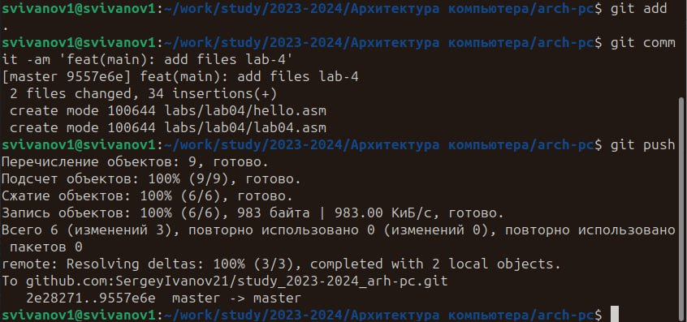{#fig:011 width=70%}

# Выводы

В ходе выполнения лабораторной работы мы освоили процедуры компиляции и сборки программ, написанных на ассемблере NASM.
