---
## Front matter
title: "Отчёт по лабораторной работе №5"
subtitle: "Дисциплина: Архитектура Компьютера"
author: "Иванов Сергей Владимирович"

## Generic otions
lang: ru-RU
toc-title: "Содержание"

## Bibliography
bibliography: bib/cite.bib
csl: pandoc/csl/gost-r-7-0-5-2008-numeric.csl

## Pdf output format
toc: true # Table of contents
toc-depth: 2
lof: true # List of figures
fontsize: 12pt
linestretch: 1.5
papersize: a4
documentclass: scrreprt
## I18n polyglossia
polyglossia-lang:
  name: russian
  options:
	- spelling=modern
	- babelshorthands=true
polyglossia-otherlangs:
  name: english
## I18n babel
babel-lang: russian
babel-otherlangs: english
## Fonts
mainfont: PT Serif
romanfont: PT Serif
sansfont: PT Sans
monofont: PT Mono
mainfontoptions: Ligatures=TeX
romanfontoptions: Ligatures=TeX
sansfontoptions: Ligatures=TeX,Scale=MatchLowercase
monofontoptions: Scale=MatchLowercase,Scale=0.9
## Biblatex
biblatex: true
biblio-style: "gost-numeric"
biblatexoptions:
  - parentracker=true
  - backend=biber
  - hyperref=auto
  - language=auto
  - autolang=other*
  - citestyle=gost-numeric
## Pandoc-crossref LaTeX customization
figureTitle: "Рис."
listingTitle: "Листинг"
lofTitle: "Список иллюстраций"
lolTitle: "Листинги"
## Misc options
indent: true
header-includes:
  - \usepackage{indentfirst}
  - \usepackage{float} # keep figures where there are in the text
  - \floatplacement{figure}{H} # keep figures where there are in the text
---

# Цель работы

Целью работы является приобретение практических навыков работы в Midnight Commander и освоение инструкций языка ассемблера mov и int.
                    
# Выполнение лабораторной работы

Откроем Midnight Commander и перейдем в каталог созданный при выполнении лабораторной работы №4.(Рис. @fig:001)

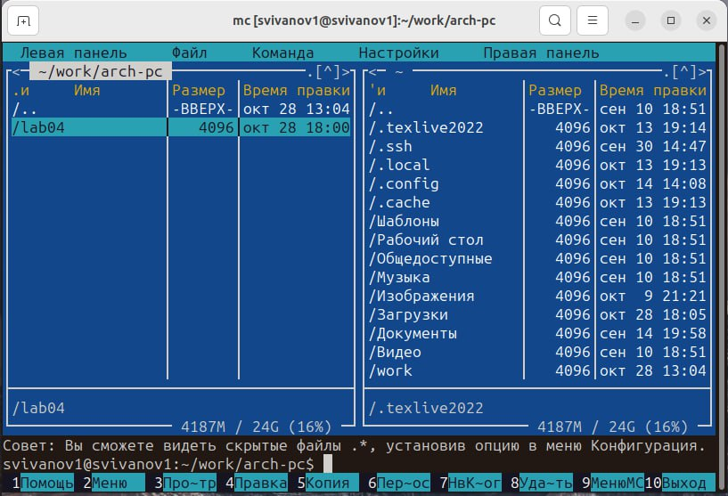{#fig:001 width=70%}

Создадим папку lab05, а в ней файл lab5-1.asm (Рис. @fig:002)

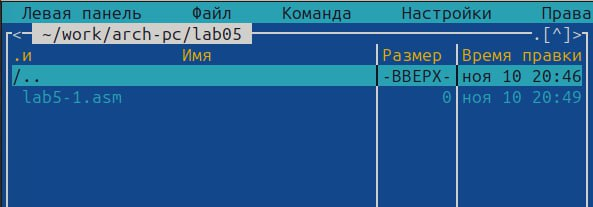{#fig:002 width=70%}

Откроем файл lab5-1.asm и отредактируем его. (Рис. @fig:003)

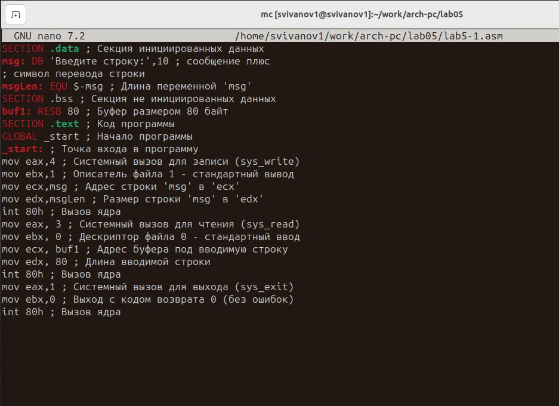{#fig:003 width=70%}

Оттранслируем текст программы в объектный файл. Выполним компоновку объектного файла и запустим исполняемый файл. На запрос вводим ФИО. (Рис. @fig:004)

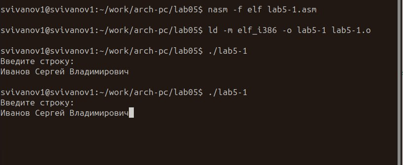{#fig:004 width=70%}

Скачаем файл in_out.asm со страницы курса в ТУИС. (Рис. @fig:005)

{#fig:005 width=70%}

Скопируем файл in_out.asm в каталог с файлом lab5-1.asm с помощью функциональной клавиши f5. (Рис. @fig:006)

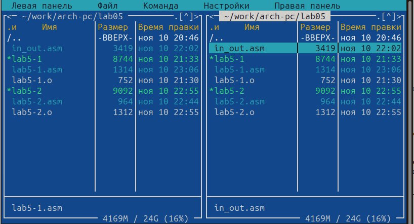{#fig:006 width=70%}

Создадим копию файла lab5-1.asm с именем lab5-2.asm (Рис. @fig:007)

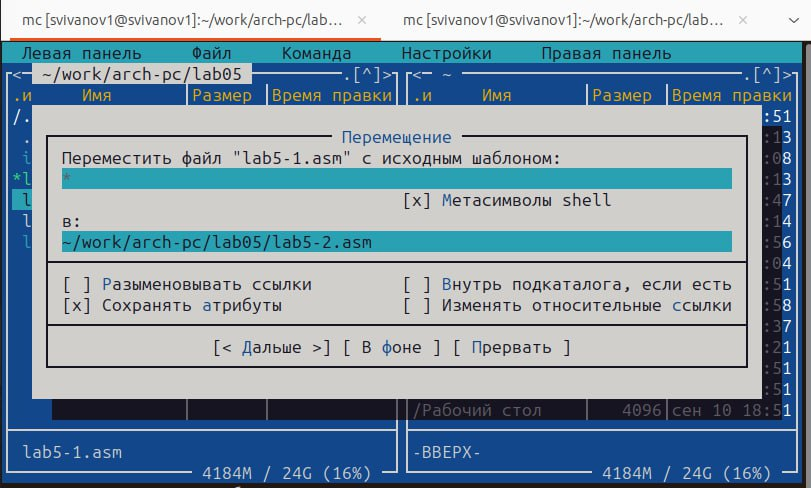{#fig:007 width=70%}

Исправим текст программы lab5-2.asm с использованием подпрограмм из внешнего файла in_out.asm (Рис. @fig:008)

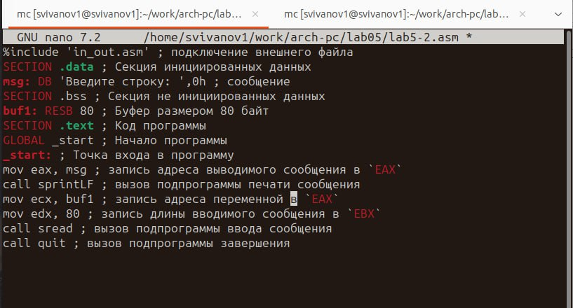{#fig:008 width=70%}

Создадим исполняемый файл и проверим его работу. Все работает правильно. (Рис. @fig:009)

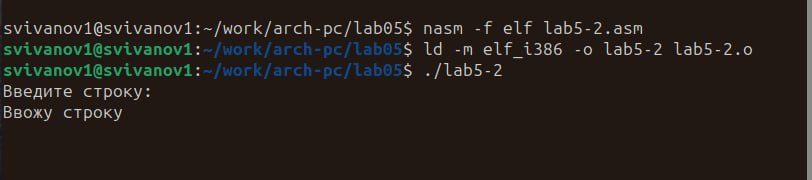{#fig:009 width=70%}

В файле lab5-2.asm заменим подпрограмму sprintLF на sprint. Создадим исполняемый файл и проверим его работу. Разница в том, что теперь строка на ввод не переносится, как это было в прошлом варианте. (Рис. @fig:010)

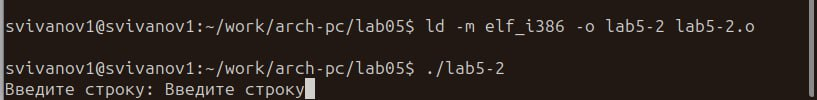{#fig:010 width=70%}

Создадим копию файла lab5-1.asm с именем lab5-3.asm. Внесем изменения в программу чтобы она выводила введённую строку на экран.(без использования внешнего файла in_out.asm) (Рис. @fig:011)

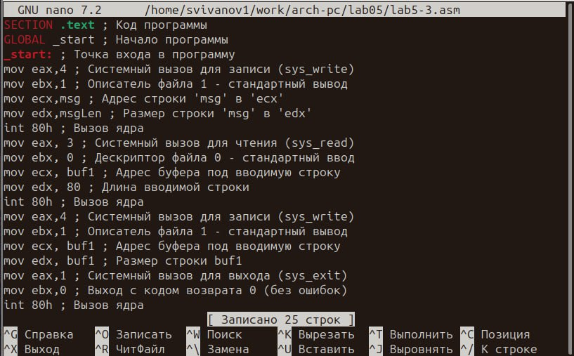{#fig:011 width=70%}

Получим исполняемый файл и убедимся что он работает правильно. На приглашение ввести строку вводим свою фамилию. (Рис. @fig:012)

{#fig:012 width=70%}

**Код программы из пункта 1 самостоятельной работы:**
```assembler
SECTION .data ; Секция инициированных данных
msg: DB 'Введите строку:',10 ;
msgLen: EQU $-msg ; Длина переменной 'msg'
SECTION .bss ; Секция не инициированных данных
buf1: RESB 80 ; Буфер размером 80 байт
SECTION .text ; Код программы
GLOBAL _start ; Начало программы
_start: ; Точка входа в программу
mov eax,4 ; Системный вызов для записи (sys_write)
mov ebx,1 ; Описатель файла 1 - стандартный вывод
mov ecx,msg ; Адрес строки 'msg' в 'ecx'
mov edx,msgLen ; Размер строки 'msg' в 'edx'
int 80h ; Вызов ядра
mov eax, 3 ; Системный вызов для чтения (sys_read)
mov ebx, 0 ; Дескриптор файла 0 - стандартный ввод
mov ecx, buf1 ; Адрес буфера под вводимую строку
mov edx, 80 ; Длина вводимой строки
int 80h ; Вызов ядра
mov eax,4 ; Системный вызов для записи (sys_write)
mov ebx,1 ; Описатель файла 1 - стандартный вывод
mov ecx, buf1 ; Адрес буфера под вводимую строку
mov edx, buf1 ; Размер строки buf1
int 80h ; Вызов ядра
mov eax,1 ; Системный вызов для выхода (sys_exit)
mov ebx,0 ; Выход с кодом возврата 0 (без ошибок)
int 80h ; Вызов ядра
```
Создадим копию файла lab5-1.asm с именем lab5-4.asm. Внесем изменения в программу чтобы она выводила введённую строку на экран.(с использованием внешнего файла in_out.asm) (Рис. @fig:013)

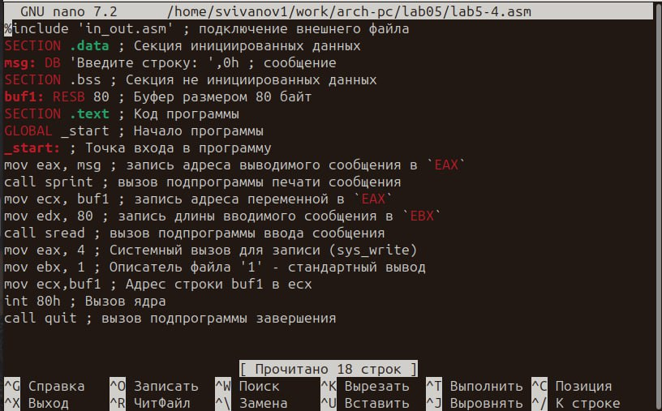{#fig:013 width=70%}

Получим исполняемый файл и убедимся что он работает правильно. (Рис. @fig:014)

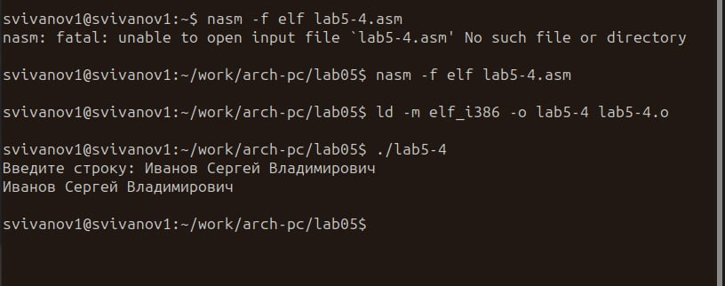{#fig:014 width=70%}

**Код программы из пункта 3 самостоятельной работы:**
```assembler
%include 'in_out.asm' ; подключение внешнего файла
SECTION .data ; Секция инициированных данных
msg: DB 'Введите строку: ',0h ; сообщение
SECTION .bss ; Секция не инициированных данных
buf1: RESB 80 ; Буфер размером 80 байт
SECTION .text ; Код программы
GLOBAL _start ; Начало программы
_start: ; Точка входа в программу
mov eax, msg ; запись адреса выводимого сообщения в `EAX`
call sprint ; вызов подпрограммы печати сообщения
mov ecx, buf1 ; запись адреса переменной в `EAX`
mov edx, 80 ; запись длины вводимого сообщения в `EBX`
call sread ; вызов подпрограммы ввода сообщения
mov eax, 4 ; Системный вызов для записи (sys_write)
mov ebx, 1 ; Описатель файла '1' - стандартный вывод
mov ecx,buf1 ; Адрес строки buf1 в ecx
int 80h ; Вызов ядра
call quit ; вызов подпрограммы завершения
```
# Выводы

В результате выполнения лабораторной работы мы приобрели практические навыки работы в Midnight Commander и освоенили инструкции языка ассемблера mov и int.


