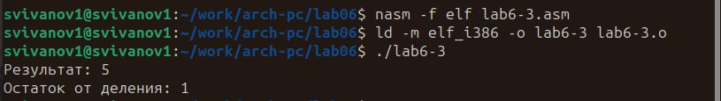

---
## Front matter
title: "Отчёт по лабораторной работе №6"
subtitle: "Дисциплина: Архитектура Компьютера"
author: "Иванов Сергей Владимирович"

## Generic otions
lang: ru-RU
toc-title: "Содержание"

## Bibliography
bibliography: bib/cite.bib
csl: pandoc/csl/gost-r-7-0-5-2008-numeric.csl

## Pdf output format
toc: true # Table of contents
toc-depth: 2
lof: true # List of figures
fontsize: 12pt
linestretch: 1.5
papersize: a4
documentclass: scrreprt
## I18n polyglossia
polyglossia-lang:
  name: russian
  options:
	- spelling=modern
	- babelshorthands=true
polyglossia-otherlangs:
  name: english
## I18n babel
babel-lang: russian
babel-otherlangs: english
## Fonts
mainfont: PT Serif
romanfont: PT Serif
sansfont: PT Sans
monofont: PT Mono
mainfontoptions: Ligatures=TeX
romanfontoptions: Ligatures=TeX
sansfontoptions: Ligatures=TeX,Scale=MatchLowercase
monofontoptions: Scale=MatchLowercase,Scale=0.9
## Biblatex
biblatex: true
biblio-style: "gost-numeric"
biblatexoptions:
  - parentracker=true
  - backend=biber
  - hyperref=auto
  - language=auto
  - autolang=other*
  - citestyle=gost-numeric
## Pandoc-crossref LaTeX customization
figureTitle: "Рис."
listingTitle: "Листинг"
lofTitle: "Список иллюстраций"
lolTitle: "Листинги"
## Misc options
indent: true
header-includes:
  - \usepackage{indentfirst}
  - \usepackage{float} # keep figures where there are in the text
  - \floatplacement{figure}{H} # keep figures where there are in the text
---

# Цель работы

Целью работы является освоение арифметических инструкций языка ассемблера NASM.
                    
# Выполнение лабораторной работы

Создадим каталог для программам лабораторной работы № 6, перейдем в него и создадим файл lab6-1.asm:.(Рис. @fig:001)

{#fig:001 width=70%}

Введем в файл lab6-1.asm текст программы из листинга 6.1 (Рис. @fig:002)

{#fig:002 width=70%}

Создадим исполняемый файл и запустим его. (Рис. @fig:003)

{#fig:003 width=70%}

Изменим текст программы и вместо символов запишем в регистры числа. (Рис. @fig:004)

{#fig:004 width=70%}

Создадим исполняемый фал и запустим его. (Рис. @fig:005)

{#fig:005 width=70%}

Пользуясь таблицей ASCII определяем, что это символ LF,перевод строки, он не отображается при выводе на экран. 

Создадим файл lab6-2.asm в каталоге ~/work/arch-pc/lab06 и введем в него текст программы из листинга 6.2 (Рис. @fig:006)

{#fig:006 width=70%}

Создадим исполняемый файл и запустим его. (Рис. @fig:007)

{#fig:007 width=70%}

Аналогично предыдущему примеру изменим символы на числа. Создадим исполняемый файл и запустим его. Получаем число 10. (Рис. @fig:008)

{#fig:008 width=70%}

Заменим функцию iprintLF на iprint. Создадим исполняемый файл и запустим его. (Рис. @fig:009)

{#fig:009 width=70%}

Отличие функций в том, что во втором случае строка не переносится.

Создадим файл lab6-3.asm в каталоге ~/work/arch-pc/lab06 и введем в него текст программы из листинга 6.3 (Рис. @fig:010)

{#fig:010 width=70%}

Cоздадим исполняемый файл и запустим его. (Рис. @fig:011)

{#fig:011 width=70%}

Изменим текст программы для вычисления выражения f(x) = (4*6+2)/5. (Рис. @fig:012)

{#fig:012 width=70%}

Cоздадим исполняемый файл и запустим его. (Рис. @fig:013)

{#fig:013 width=70%}

Создадим файл variant.asm в каталоге ~/work/arch-pc/lab06 и введем в него текст программы из листинга 6.4 (Рис. @fig:014)

{#fig:014 width=70%}

Cоздадим исполняемый файл и запустим его. (Рис. @fig:015)

{#fig:015 width=70%}

Решив аналитически получаем: 1132236127/20 = 56611806, остаток 7. Прибавляем +1, получаем 8. Ответ сошелся.

**Ответы на вопросы:**

1) mov eax,rem

   call sprint
   
2) Для считывания переменной х, которую вводит пользователь

3) Для перевода ASCII в число

4) xor edx,edx

   mov ebx,20
   
   div ebx
   
   inc edx
   
5) В регистр edx

6) Увеличивает значение edx на 1

7) mov eax,edx

   call iprintLF
   
Создадим файл lab6-4.asm. Напишем программу из таблицы 6.3 для варианта 8. ((11+х)*2-6)  (Рис. @fig:016)

{#fig:016 width=70%}

Cоздадим исполняемый файл и запустим его. Проверим раюоту программы для x=1 и x=9. (Рис. @fig:016)

{#fig:017 width=70%}

**Код программы lab6-4**
```assembler
%include 'in_out.asm' ;
section .data
    prompt: DB 'Введите значение x: ', 0
    msg: DB 'Выражение (11+x)*2-6: ', 0
    div: DB 'Результат: ', 0
section .bss
    x: RESB 80
section .text
global _start
_start:
mov eax, msg
call sprintLF
mov eax, prompt
call sprint
mov ecx, x
mov edx, 80
call sread
mov eax, x
call atoi
mov ebx, 2
add eax, 11
mul ebx
sub eax, 6
call iprintLF
call quit
```

# Выводы

В результате выполнения лабораторной работы мы освоили арифметические инструкции языка ассемблера NASM.

