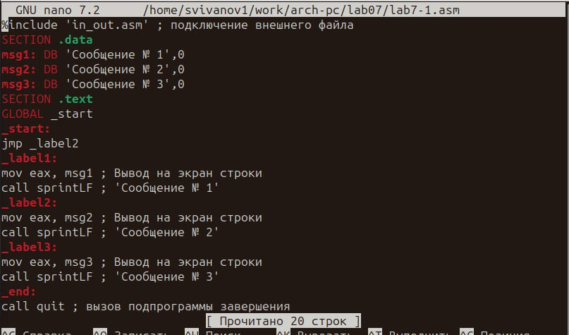

---
## Front matter
title: "Отчёт по лабораторной работе №7"
subtitle: "Дисциплина: Архитектура Компьютера"
author: "Иванов Сергей Владимирович"

## Generic otions
lang: ru-RU
toc-title: "Содержание"

## Bibliography
bibliography: bib/cite.bib
csl: pandoc/csl/gost-r-7-0-5-2008-numeric.csl

## Pdf output format
toc: true # Table of contents
toc-depth: 2
lof: true # List of figures
fontsize: 12pt
linestretch: 1.5
papersize: a4
documentclass: scrreprt
## I18n polyglossia
polyglossia-lang:
  name: russian
  options:
	- spelling=modern
	- babelshorthands=true
polyglossia-otherlangs:
  name: english
## I18n babel
babel-lang: russian
babel-otherlangs: english
## Fonts
mainfont: PT Serif
romanfont: PT Serif
sansfont: PT Sans
monofont: PT Mono
mainfontoptions: Ligatures=TeX
romanfontoptions: Ligatures=TeX
sansfontoptions: Ligatures=TeX,Scale=MatchLowercase
monofontoptions: Scale=MatchLowercase,Scale=0.9
## Biblatex
biblatex: true
biblio-style: "gost-numeric"
biblatexoptions:
  - parentracker=true
  - backend=biber
  - hyperref=auto
  - language=auto
  - autolang=other*
  - citestyle=gost-numeric
## Pandoc-crossref LaTeX customization
figureTitle: "Рис."
listingTitle: "Листинг"
lofTitle: "Список иллюстраций"
lolTitle: "Листинги"
## Misc options
indent: true
header-includes:
  - \usepackage{indentfirst}
  - \usepackage{float} # keep figures where there are in the text
  - \floatplacement{figure}{H} # keep figures where there are in the text
---

# Цель работы

Целью лабораторной работы является изучение команд условного и безусловного переходов, приобретение навыков написания программ с использованием переходов и знакомство с назначением и структурой файла листинга.
                    
# Выполнение лабораторной работы

Создадим каталог для программ лабораторной работы № 7, перейдём в него и создадим файл lab7-1.asm.(Рис. @fig:001)

{#fig:001 width=70%}

Введем в файл lab7-1.asm текст программы из листинга 7.1 (Рис. @fig:002)

{#fig:002 width=70%}

Создадим исполняемый файл и запустим его. (Рис. @fig:003)

{#fig:003 width=70%}

Изменим текст программы в соответствии с листингом 7.2, создадим исполняемый файл и проверим его работу. (Рис. @fig:004)

{#fig:004 width=70%}

Изменим текст программы добавив или изменив инструкции jmp, чтобы вывод программы был следующим: Сообщение №3, Сообщение №2, Сообщение №1. (Рис. @fig:005)

{#fig:005 width=70%}

Создадим исполняемый файл и запустим его. (Рис. @fig:006)

{#fig:006 width=70%}

Создадим файл lab7-2.asm в каталоге ~/work/arch-pc/lab07. Введём в lab7-2.asm текст из листинга 7.3. Создадим исполняемый файл и проверим его работу для разных значений B. (Рис. @fig:007)

{#fig:007 width=70%}

Создадим файл листинга для программы из файла lab7-2.asm и откроем его с помощью mcedit. (Рис. @fig:008)

{#fig:008 width=70%}

Объясним содержание строк 4,5 и 8: 

Строка 4: 4-номер строки, 00000000-адрес строки, 53-машинный код, push ebx-исходный текст программы.

Строка 5: 5-номер строки, 00000001-адрес строки, 89С3-машинный код, mov ebx,eax-исходный текст программы

Строка 8: 8-номер строки, 00000003-адрес строки, 803800-машинный код, cmp byte[eax],0-исходный текст программы

Откроем файл с программой lab7-2.asm и в строке mov edx,10 удалим 10 (Рис. @fig:009)

{#fig:009 width=70%}

Создадим файл листинга и откроем его. Как мы видим, в строке в которой мы удалили операнд, появилось сообщение об ошибке, а в первой части листинга появились * .(Рис. @fig:010)

{#fig:010 width=70%}

Напишем программу нахождения наименьшей из 3 целочисленных переменных a,b и c в соответствии со своим вариантом(8). Создадим исполняемый файл и проверим его работу. Программа работает правильно. (Рис. @fig:011)

{#fig:011 width=70%}

**Листинг программы для самостоятельной работы 1(lab7-3.asm):**
```assembler
%include 'in_out.asm'
section .data
msg2 db "Наименьшее число: ",0h
A dd '52'
B dd '33'
C dd '40'
section .bss
min resb 10
section .text
global _start
_start:
mov eax,B
call atoi
mov [B],eax
; ---------- Записываем 'A' в переменную 'min'
mov ecx,[A] ; 'ecx = A'
mov [min],ecx ; 'min = A'
; ---------- Сравниваем 'A' и 'С' (как символы)
cmp ecx,[C] ; Сравниваем 'A' и 'С'
jl check_B ; если 'A<C', то переход на метку 'check_B',
mov ecx,[C] ; иначе 'ecx = C'
mov [min],ecx ; 'min = C'
; ---------- Преобразование 'min(A,C)' из символа в число
check_B:
mov eax,min
call atoi ; Вызов подпрограммы перевода символа в число
mov [min],eax ; запись преобразованного числа в `min`
; ---------- Сравниваем 'min(A,C)' и 'B' (как числа)
mov ecx,[min]
cmp ecx,[B] ; Сравниваем 'min(A,C)' и 'B'
jl fin ; если 'min(A,C)<B', то переход на 'fin',
mov ecx,[B] ; иначе 'ecx = B'
mov [min],ecx
; ---------- Вывод результата
fin:
mov eax, msg2
call sprint ; 
mov eax,[min]
call iprintLF ;
call quit ; Выход
```

Напишем программу, которая для введенных с клавиатуры значений x и a вычисляет значение заданной функции f(x) и выводит результат вычислений. Создадим исполняемый файл и проверим его работу для значений x и a из 7.6.(Вариант 8). (Рис. @fig:012)

{#fig:012 width=70%}

**Листинг программы для самостоятельной работы 2(lab7-4.asm):**
```assembler
%include 'in_out.asm'
section .data
msg1 DB "Введите X: ",0h
msg2 DB "Введите A: ",0h
msg3 DB "Ответ: ",0h
section .bss
x: RESB 80
a: RESB 80
ans: RESB 80
section .text
global _start
_start:
mov eax,msg1
call sprint
mov ecx,x
mov edx,80
call sread
mov eax,x
call atoi
mov [x],eax
mov eax,msg2
call sprint
mov ecx,a
mov edx, 80
call sread
mov eax,a
call atoi
mov [a],eax

mov eax,[a]
cmp eax,3
jl xsa

mov eax,[x]
add eax,1
jmp ansv

xsa:
mov ebx,3
mov eax,[a]
mul ebx
ansv:
mov [ans],eax
mov eax,msg3
call sprint
mov eax,[ans]
call iprintLF
call quit
```

# Выводы

В результате выполнения лабораторной работы мы изучили команды условного и безусловного переходов, приобрели навыки написания программ с использованием переходов и познакомились с назначением и структурой файла листинга.

