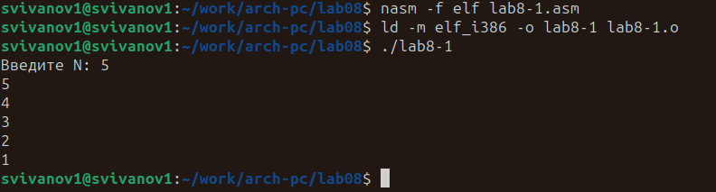

---
## Front matter
title: "Отчёт по лабораторной работе №8"
subtitle: "Дисциплина: Архитектура Компьютера"
author: "Иванов Сергей Владимирович"

## Generic otions
lang: ru-RU
toc-title: "Содержание"

## Bibliography
bibliography: bib/cite.bib
csl: pandoc/csl/gost-r-7-0-5-2008-numeric.csl

## Pdf output format
toc: true # Table of contents
toc-depth: 2
lof: true # List of figures
fontsize: 12pt
linestretch: 1.5
papersize: a4
documentclass: scrreprt
## I18n polyglossia
polyglossia-lang:
  name: russian
  options:
	- spelling=modern
	- babelshorthands=true
polyglossia-otherlangs:
  name: english
## I18n babel
babel-lang: russian
babel-otherlangs: english
## Fonts
mainfont: PT Serif
romanfont: PT Serif
sansfont: PT Sans
monofont: PT Mono
mainfontoptions: Ligatures=TeX
romanfontoptions: Ligatures=TeX
sansfontoptions: Ligatures=TeX,Scale=MatchLowercase
monofontoptions: Scale=MatchLowercase,Scale=0.9
## Biblatex
biblatex: true
biblio-style: "gost-numeric"
biblatexoptions:
  - parentracker=true
  - backend=biber
  - hyperref=auto
  - language=auto
  - autolang=other*
  - citestyle=gost-numeric
## Pandoc-crossref LaTeX customization
figureTitle: "Рис."
listingTitle: "Листинг"
lofTitle: "Список иллюстраций"
lolTitle: "Листинги"
## Misc options
indent: true
header-includes:
  - \usepackage{indentfirst}
  - \usepackage{float} # keep figures where there are in the text
  - \floatplacement{figure}{H} # keep figures where there are in the text
---

# Цель работы

Целью лабораторной работы является приобретение навыков написания программ с использованием циклов и обработкой аргументов командной строки.
                    
# Выполнение лабораторной работы

Создадим каталог для программ лабораторной работы № 8, перейдем в него и создадим файл lab8-1.asm.(Рис. @fig:001)

{#fig:001 width=70%}

Введем в файл lab8-1.asm текст программы из листинга 8.1, создадим исполняемый файл и запустим его. (Рис. @fig:002)

{#fig:002 width=70%}

Изменим текст программы добавив изменение значение регистра ecx в цикле, добавим строчку sub ecx,1 , создадим исполняемый файл и запустим его. (Рис. @fig:003)

{#fig:003 width=70%}

Каждую итерацию ecx принимает значения, на 2 меньшее предыдущего. Из-за этого, количество проходов в 2 раза меньше, чем N. При этом, если N нечётное, ecx не сможет достичь нуля (т.к. мы через него перепрыгиваем, от 1 до -1), из-за чего получается бесконечный цикл

Внесём изменения в текст программы добавив команды push
и pop (добавления в стек и извлечения из стека) для сохранения значения счетчика цикла loop, создадим исполняемый файл и запустим его. (Рис. @fig:004)

{#fig:004 width=70%}

Теперь число проходов цикла соответствует значению N введенному с клавиатуры.

Создадим файл lab8-2.asm в каталоге ~/work/arch-pc/lab08 и введём в него текст программы из листинга 8.2. Создадим исполняемый файл и запустим его, указав аргументы. (Рис. @fig:005)

{#fig:005 width=70%}

Программа обработала 4 аргумента.

Создадим файл lab8-3.asm в каталоге ~/work/arch-pc/lab08 и введём в него текст программы из листинга 8.3. Создадим исполняемый файл и запустим его указав аргументы. (Рис. @fig:006)

{#fig:006 width=70%}

Изменим текст программы из листинга 8.3 для вычисления произведения аргументов командной строки. (Рис. @fig:007)

{#fig:007 width=70%}

Создадим исполняемый файл и запустим его. (Рис. @fig:008)

{#fig:008 width=70%}

Напишем программу lab8-4.asm, которая находит сумму значений функции f(x) для варината 8 (f(x)=7+2x). (Рис. @fig:009)

{#fig:009 width=70%}

**Листинг программы для самостоятельной работы (lab8-4.asm):**
```assembler
%include 'in_out.asm'
SECTION .data
msg db "Результат: ",0
msg1 db "Функция: f(x)=7+2x",0
SECTION .text
global _start
_start:
mov eax,msg1
call sprintLF
pop ecx ; Извлекаем из стека в ecx количество
; аргументов (первое значение в стеке)
pop edx ; Извлекаем из стека в edx имя программы
; (второе значение в стеке)
sub ecx,1 ; Уменьшаем ecx на 1 (количество
; аргументов без названия программы)
mov esi, 0 ; Используем esi для хранения
; промежуточных сумм
next:
cmp ecx,0h ; проверяем, есть ли еще аргументы
jz _end ; если аргументов нет выходим из цикла
; (переход на метку _end)
pop eax ; иначе извлекаем следующий аргумент из стека
call atoi ; преобразуем символ в число
add eax,eax
add eax,7
add esi,eax ; добавляем к промежуточной сумме
; след. аргумент esi=esi+eax
loop next ; переход к обработке следующего аргумента
_end:
mov eax, msg ; вывод сообщения "Результат: "
call sprint
mov eax, esi ; записываем сумму в регистр eax
call iprintLF ; печать результата
call quit ; завершение программы
```
# Выводы

В результате выполнения лабораторной работы мы приобрели навыки написания программ с использованием циклов и обработки аргументов командной строки.

