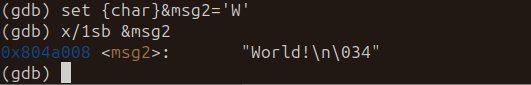
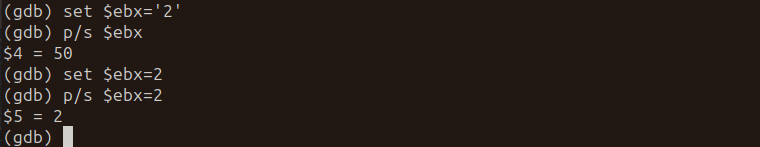
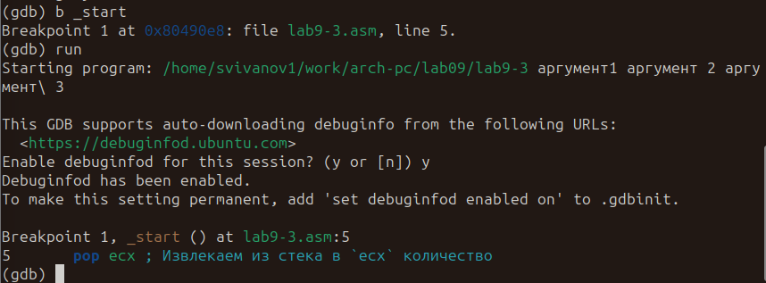

---
## Front matter
title: "Отчёт по лабораторной работе №9"
subtitle: "Архитектура компьютера"
author: "Иванов Сергей Владимирович"

## Generic otions
lang: ru-RU
toc-title: "Содержание"

## Bibliography
bibliography: bib/cite.bib
csl: pandoc/csl/gost-r-7-0-5-2008-numeric.csl

## Pdf output format
toc: true # Table of contents
toc-depth: 2
lof: true # List of figures
fontsize: 12pt
linestretch: 1.5
papersize: a4
documentclass: scrreprt
## I18n polyglossia
polyglossia-lang:
  name: russian
  options:
	- spelling=modern
	- babelshorthands=true
polyglossia-otherlangs:
  name: english
## I18n babel
babel-lang: russian
babel-otherlangs: english
## Fonts
mainfont: PT Serif
romanfont: PT Serif
sansfont: PT Sans
monofont: PT Mono
mainfontoptions: Ligatures=TeX
romanfontoptions: Ligatures=TeX
sansfontoptions: Ligatures=TeX,Scale=MatchLowercase
monofontoptions: Scale=MatchLowercase,Scale=0.9
## Biblatex
biblatex: true
biblio-style: "gost-numeric"
biblatexoptions:
  - parentracker=true
  - backend=biber
  - hyperref=auto
  - language=auto
  - autolang=other*
  - citestyle=gost-numeric
## Pandoc-crossref LaTeX customization
figureTitle: "Рис."
tableTitle: "Таблица"
listingTitle: "Листинг"
lofTitle: "Список иллюстраций"
lolTitle: "Листинги"
## Misc options
indent: true
header-includes:
  - \usepackage{indentfirst}
  - \usepackage{float} # keep figures where there are in the text
  - \floatplacement{figure}{H} # keep figures where there are in the text
---

# Цель работы

Целью лабораторной работы является приобретение навыков написания программ с использованием подпрограмм. Знакомство с методами отладки при помощи GDB и его основными возможностями.

# Выполнение лабораторной работы

Создадим каталог для программ лабораторной работы № 9, перейдем в него и создадим файл lab9-1.asm.(рис. @fig:001).

{#fig:001 width=70%}

Введем в файл программу листинга 9.1, создадим исполняемый файл и проверим его работу.(рис. @fig:002).
 
{#fig:002 width=70%}

Изменим текст программы добавив подпрограмму _subcalcul в подпрограмму _calcul, для вычисления выражения f(g(x)), где x вводится с клавиатуры, f(x) = 2x + 7, g(x) = 3x − 1. (рис. @fig:003).

{#fig:003 width=70%}

Создадим исполняемый файл и запустим его, программа работает корректно. (рис. @fig:004).

{#fig:004 width=70%}

Создадим файл lab9-2.asm с текстом программы из Листинга 9.2. Получим исполняемый файл. Загрузим исполняемый файл в отладчик gdb. Проверим работу программы, запустив ее в оболочке GDB с помощью команды run(рис. @fig:005).

{#fig:005 width=70%}

Установим брейкпоинт на метку _start, и запустим её(рис. @fig:006).
 
{#fig:006 width=70%}

Посмотрим дисассимилированный код программы с помощью команды disassemble начиная с метки _start. Переключимся на отображение команд с Intel’овским синтаксисом, введя команду set disassembly-flavor intel(рис. @fig:007).

{#fig:007 width=70%}

Pазличия отображения синтаксиса машинных команд в режимах ATT и Intel: противоположное расположение операнда-источника и операнда-приемника; в ATT регистры пишутся после ‘%’, а непосредственные операнды после ‘$’, в синтаксисе Intel операнды никак не помечаются.

Включим режим псевдографики для более удобного анализа программы(рис. @fig:008).

{#fig:008 width=70%}

На предыдущих шагах была установлена точка останова по имени метки (_start). Проверим это с помощью команды info breakpoints. Установим еще одну точку останова по адресу предпоследней инструкции. Посмотрим информацию о всех установленных точках останова(рис. @fig:009) .

{#fig:009 width=70%}

Выполним 5 инструкций с помощью команды stepi и проследим за изменением значений регистров. В результате изменяются значения регистров eax, ebx, ecx, edx(рис. @fig:010).

{#fig:010 width=70%}

Посмотрите значение переменной msg1 и msg2 по имени. Изменим первый символ переменной msg1(рис. @fig:011).

{#fig:011 width=70%}

 Заменим символ во второй переменной msg2.(рис. @fig:012).

{#fig:012 width=70%}

Выведем в различных форматах (в шестнадцатеричном формате, в двоичном формате и в символьном виде) значение регистра edx. (рис. @fig:013).

{#fig:013 width=70%}

С помощью команды set изменим значение регистра ebx: (рис. @fig:014).

{#fig:014 width=70%}

Использовав команду set изменили значение регистра ebx сначала на символ ‘2’, а затем на число 2, и сравнили вывод значения регистра в десятичном формате. В результате присвоения регистра значение символа ‘2’, выводится число 50, что соответствует символу в ‘2’ в таблице ASCII 

Cкопируем файл lab8-2.asm, созданный при выполнении лабораторной работы №8, с программой выводящей на экран аргументы командной строки в файл с именем lab9-3.asm. Создадим исполняемый файл. Загрузим исполняемый файл в отладчик, указав аргументы: (рис. @fig:015).

{#fig:015 width=70%}

Для начала установим точку останова перед первой инструкцией в программе и запустим ее. (рис. @fig:016).

{#fig:016 width=70%}

Посмотрим остальные позиции стека. (рис. @fig:017).

{#fig:017 width=70%}

В первом хранится адрес, в остальных хранятся элементы. Элементы расположены с интервалом в 4 единицы, так как стек может хранить до 4 байт:каждый элемент стека занимает 4 байта, поэтому для получения следующего элемента стека мы добавляем 4 к адресу вершины.

# Задание для самостоятельной работы.

1) Преобразуем программу из лабораторной работы №8 (Задание №1 для самостоятельной работы), реализовав вычисление значения функции f(x) как подпрограмму. Запустим файл. Программа работает корректно. (рис. @fig:018).

```nasm
%include 'in_out.asm'

SECTION .data
    msg db "Результат: ", 0
    msg1 db "Функция: f(x)=7+2x", 0

SECTION .text
global _start

; Подпрограмма для вычисления функции f(x)
calculate_f:
    ; Вход: eax - значение x
    ; Выход: eax - результат функции f(x)
    add eax, eax  ; умножение x на 2
    add eax, 7    ; добавление 7
    ret

_start:
    mov eax, msg1
    call sprintLF
    pop ecx  ; Извлекаем из стека в ecx количество аргументов
    pop edx  ; Извлекаем из стека в edx имя программы

    sub ecx, 1  ; Уменьшаем ecx на 1 (количество аргументов без названия программы)
    mov esi, 0  ; Используем esi для хранения промежуточных сумм

next:
    cmp ecx, 0h  ; Проверяем, есть ли еще аргументы
    jz _end  ; Если аргументов нет, выходим из цикла

    pop eax  ; Иначе извлекаем следующий аргумент из стека
    call atoi  ; Преобразуем символ в число
    call calculate_f  ; Вызываем подпрограмму для вычисления f(x)
    add esi, eax  ; Добавляем к промежуточной сумме следующий аргумент (esi = esi + f(x))
    loop next  ; Переход к обработке следующего аргумента

_end:
    mov eax, msg  ; Вывод сообщения "Результат: "
    call sprint
    mov eax, esi  ; Записываем сумму в регистр eax
    call iprintLF  ; Печать результата
    call quit  ; Завершение программы
```

{#fig:018 width=70%}

2) Создадим файл с текстом из листинга 9.3, где приведена программа вычисления выражения (3+2)*4+5. При запуске данная программа дает неверный результат

Проанализируем с помощью отладичка GDB изменение значений регистров, чтобы найти ошибку. Установим брейкпоинт b _start, включим режим псевдографики и начнём поочердно выполнять команды и следить за значениями регистров. Ошибка в том, что результат 3+2=5 записан в регистре ebx (команда add ebx, eax), но команда mul всегда перемножает значение регистра eax с указанным сомножителем, поэтому mul ecx дает неверный результат. Затем, к нему добавляется число 5, результат запоминается в регистре edi, а затем выводится (рис. @fig:019).

{#fig:019 width=70%}
   
Исправим текст программы:
```nasm
%include 'in_out.asm'
SECTION .data
div: DB 'Результат: ',0
SECTION .text
GLOBAL _start
_start:
; ---- Вычисление выражения (3+2)*4+5
mov ebx,3
mov eax,2
add eax,ebx
mov ecx,4
mul ecx
add eax,5
mov edi,eax
; ---- Вывод результата на экран
mov eax,div
call sprint
mov eax,edi
call iprintLF
call quit
```
 
Запустим файл. Программа работает корректно.(рис. @fig:020).
 
{#fig:020 width=70%}
 
# Выводы

В результате выполнения лабораторной работы мы приобрели навыки написания программ с использованием подпрограмм и познакомилась с методами отладки при помощи GDB и его основными возможностями.
