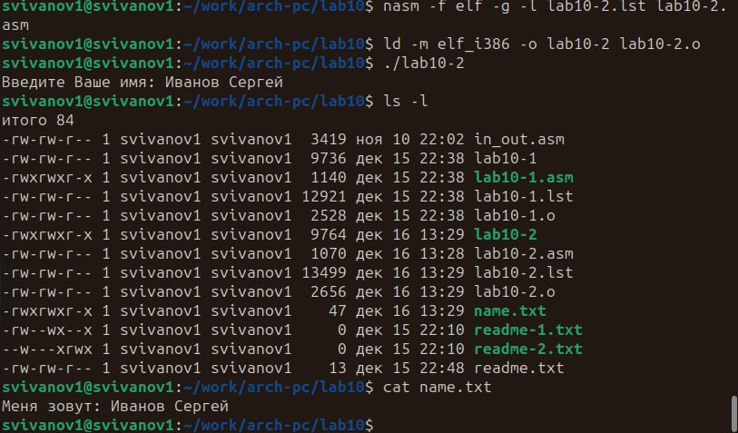

---
## Front matter
title: "Отчёт по лабораторной работе №10"
subtitle: "Архитектура компьютера"
author: "Иванов Сергей Владимирович"

## Generic otions
lang: ru-RU
toc-title: "Содержание"

## Bibliography
bibliography: bib/cite.bib
csl: pandoc/csl/gost-r-7-0-5-2008-numeric.csl

## Pdf output format
toc: true # Table of contents
toc-depth: 2
lof: true # List of figures
fontsize: 12pt
linestretch: 1.5
papersize: a4
documentclass: scrreprt
## I18n polyglossia
polyglossia-lang:
  name: russian
  options:
	- spelling=modern
	- babelshorthands=true
polyglossia-otherlangs:
  name: english
## I18n babel
babel-lang: russian
babel-otherlangs: english
## Fonts
mainfont: PT Serif
romanfont: PT Serif
sansfont: PT Sans
monofont: PT Mono
mainfontoptions: Ligatures=TeX
romanfontoptions: Ligatures=TeX
sansfontoptions: Ligatures=TeX,Scale=MatchLowercase
monofontoptions: Scale=MatchLowercase,Scale=0.9
## Biblatex
biblatex: true
biblio-style: "gost-numeric"
biblatexoptions:
  - parentracker=true
  - backend=biber
  - hyperref=auto
  - language=auto
  - autolang=other*
  - citestyle=gost-numeric
## Pandoc-crossref LaTeX customization
figureTitle: "Рис."
tableTitle: "Таблица"
listingTitle: "Листинг"
lofTitle: "Список иллюстраций"
lolTitle: "Листинги"
## Misc options
indent: true
header-includes:
  - \usepackage{indentfirst}
  - \usepackage{float} # keep figures where there are in the text
  - \floatplacement{figure}{H} # keep figures where there are in the text
---

# Цель работы

Целью лабораторной работы является приобретение навыков написания программ для работы с файлами.

# Выполнение лабораторной работы

Создадим каталог для программ лабораторной работы № 10, перейдем в него и создадим файлы lab10-1.asm, readme.txt, readme-1.txt и readme-2.txt (рис. @fig:001).

{#fig:001 width=70%}

Введем в файл lab10-1.asm программу листинга 10.1, создадим исполняемый файл и проверим его работу.(рис. @fig:002).
 
{#fig:002 width=70%}

С помощью команды chmod измениим права доступа к исполняемому файлу lab10-1, запретив его выполнение. Попытаемся выполнить файл. Как видим, нам отказано в доступе потому что мы запретили исполнение файла. (рис. @fig:003).

{#fig:003 width=70%}

С помощью команды chmod изменим права доступа к файлу lab10-1.asm с исходным текстом программы, добавив права на исполнение. Попытаемся выполнить его. К такому результату привело то, что мы дали разрешение на выполнение файла, но это не исполняемый файл, а файл с исходным текстом программы. (рис. @fig:004).

{#fig:004 width=70%}

В соответствии с вариантом в таблице 10.4 (вариант 8) предоставим права доступа к файлу readme-1.txt представленные в символьном виде. Проверим правильность выполнения с помощью команды ls -l. (рис. @fig:005).

{#fig:005 width=70%}

Для файла readme-2.txt сделаем тоже самое в двочном виде. Проверим правильность выполнения с помощью команды ls -l.(рис. @fig:006).
 
{#fig:006 width=70%}

# Задание для самостоятельной работы.

1) Напишем программу работающую по заданному алгоритму. Создадим исполняемый файл и проверим его работу. Проверим наличие файла и его содержимого с помощью команд ls и cat.(рис. @fig:007).

{#fig:007 width=70%}

```nasm
%include 'in_out.asm'
SECTION .data
filename db 'name.txt', 0h ; Имя файла
msg db 'Меня зовут: ', 0h ; Сообщение
promt db 'Введите Ваше имя: ', 0h
SECTION .bss
name resb 255 ; переменная для вводимой строки
SECTION .text
global _start
_start:
mov eax, promt
call sprint
; --- Ввести с клавиатуры свои имя и фамилию
mov ecx, name
mov edx, 255
call sread
; --- Создать файл с именем name.txt
mov edx, 2 ; режим доступа
mov ecx, 0777o ; права доступа (rw-rw-rw-)
mov ebx, filename ; имя файла
mov eax, 8 ; sys_creat
int 80h
; --- Запись "Меня зовут"
mov esi,eax
mov eax,msg
call slen
mov edx,eax
mov ecx,msg
mov ebx,esi
mov eax,4
int 80h
; --- Закрытие файла
mov ebx,esi
mov eax,6
int 80h
; --- Открытие файла
mov ecx,1
mov ebx,filename
mov eax,5
int 80h
; --- Изменение содержимого
mov esi,eax
mov edx,2
mov ecx,0
mov ebx,eax
mov eax,19
int 80h
; --- Запись в файл
mov eax,name
call slen
mov edx,eax
mov ecx,name
mov ebx,esi
mov eax,4
int 80h
; --- Закрыть файл (sys_close)
mov ebx, eax
mov eax, 6 ; sys_close
int 80h
call quit
```
 
# Выводы

В результате выполнения лабораторной работы мы приобретели навыки написания программ для работы с файлами.
